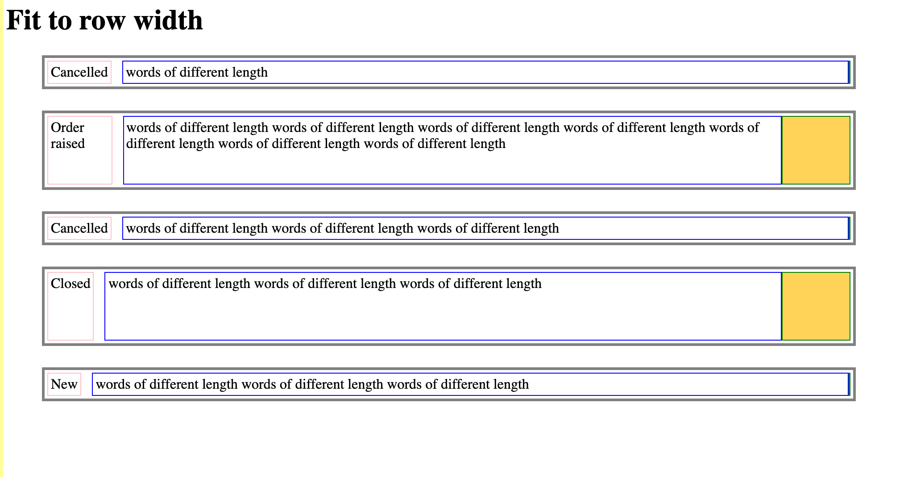

# Challenge: fit to width of row

There are 3 elements in each row.

1. A status. Text of variable length

2. Copy of variable length.

3. A thumbnail which may or may not be present. If it's present then it's shape and size are reliable.

## Notes

- The gap between the status and the copy should be consistent. 

- The width of the copy should be 100% of the remaining row width, irrespective of whether the thumbnail is present or not.

- See https://flexboxfroggy.com for some help!

## Screenshot of desired layout

